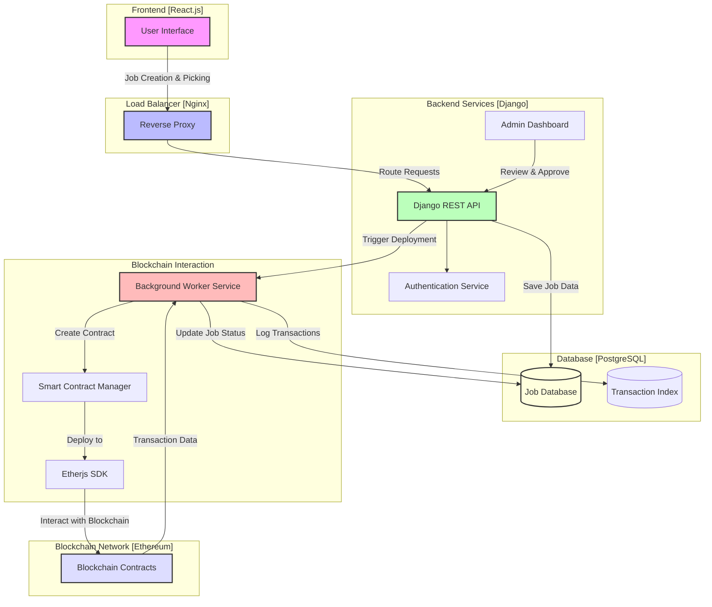

# King Job Platform

## Live Website
[https://king-job.kingofshiba.xyz/](https://king-job.kingofshiba.xyz/)

**Note**: Visit the live platform to explore the full functionality of the King Job platform.

## Project Overview

King Job is a Web3-based platform that connects clients and freelancers. Clients can create jobs, push them to the blockchain, and collaborate with freelancers. The platform ensures transparent and secure job management using blockchain technology.

## Tech Stack

- **Frontend**: React.js
- **Backend**: Django (Python)
- **Blockchain Development**: Hardhat, Solidity
- **Database**: PostgreSQL
- **Containerization**: Docker
- **Additional Technologies**:
  - Etherjs SDK
  - JavaScript/TypeScript
  - Nginx (Reverse Proxy)

## System Architecture

### Key Components

1. **Job Management**
   - Clients can create job postings.
   - Jobs are pushed to the blockchain for transparency.
   - Freelancers can pick jobs and collaborate with clients.

2. **Backend Workflow**
   - Django REST API for job management.
   - Worker service for transaction monitoring.
   - Smart contract integration for secure payment handling.

### System Flow

## Key Features

- Transparent job posting and tracking.
- Blockchain-secured transactions.
- Integrated chat for client-freelancer communication.

## Security Considerations

- Robust access controls.
- Environment-specific configurations.
- Secure blockchain transaction signing.
- Regular security audits.

## Deployment

- Use Nginx as a reverse proxy.
- Configure HTTPS for secure connections.

## Future Roadmap

- Multi-chain support for broader adoption.
- Advanced analytics dashboard for better insights.
- Enhanced user verification for trust and safety.
- Expanded features for project management and collaboration.
- AI agents for conflict resolution.
- NFT integration for unique job and freelancer identification.
- A comprehensive rating system for clients and freelancers.
- Recommendation system to match jobs with suitable freelancers.
